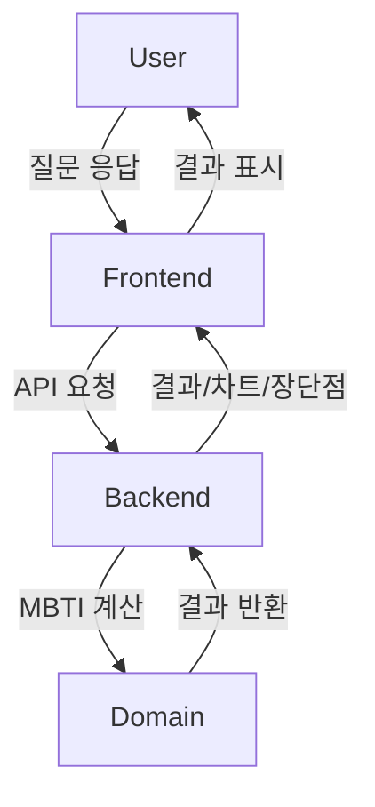

# MBTI 성격유형 분석 앱

## 소개
- 16가지 MBTI 유형을 진단하고, 결과 차트와 각 유형별 성격의 장단점을 제공합니다.
- Clean Architecture와 SOLID 원칙을 적용하여 설계 및 구현되었습니다.
- 테스트 우선(TDD) 개발을 원칙으로 합니다.

## 폴더 구조
```
backend/
  domain/         # 도메인 로직 (MBTI 계산 등)
  application/    # 유스케이스, 서비스 계층
  infrastructure/ # DB, 외부 API 연동 등
  interface/      # API, 컨트롤러
  tests/          # 테스트 코드
frontend/
  components/     # UI 컴포넌트
  pages/          # 라우팅/페이지
  tests/          # 프론트엔드 테스트
```

## 설치 및 실행 방법

### 1. 백엔드
```bash
cd backend
npm install
npm test         # 모든 도메인/서비스 테스트 실행
```

### 2. 프론트엔드
```bash
cd frontend
npm install
npm run dev      # 개발 서버 실행
npm test         # 프론트엔드 테스트 실행
```

### 3. 배포
- 프론트엔드: Vercel, Netlify, AWS Amplify 등
- 백엔드: AWS Lambda, EC2, 또는 컨테이너 기반 배포

## 개발 원칙
- Clean Architecture, SOLID 원칙 준수
- 테스트 코드 우선 작성 (TDD)
- 코드 중복 최소화(DRY)
- 단순성 우선
- AWS 리소스 Description은 영문으로 작성

## 간단 구조 다이어그램


## 주요 기능
- 16가지 MBTI 유형 진단
- 결과 차트 시각화
- 각 유형별 성격 장점/단점 안내

## 기타
- AWS 리소스 Description 예시: `Description: "MBTI API Lambda function for personality analysis"`
- 복잡한 아키텍처 다이어그램은 별도 SVG 파일로 제공합니다.
